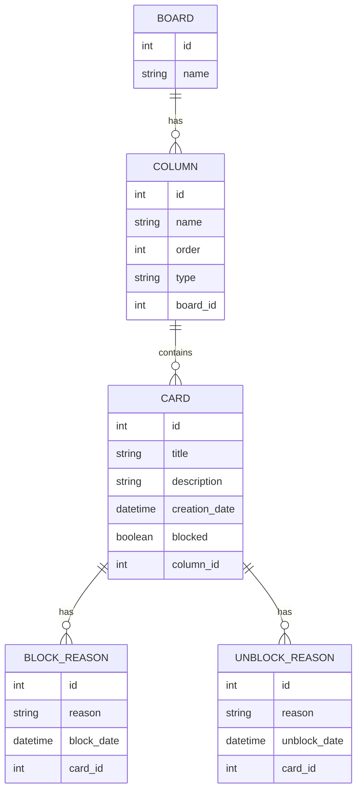

# newtest

```mermaid
erDiagram
    BOARD ||--o{ COLUMN : has
    COLUMN ||--o{ CARD : contains
    CARD ||--o{ BLOCK_REASON : has
    CARD ||--o{ UNBLOCK_REASON : has

    BOARD {
        int id
        string name
    }

    COLUMN {
        int id
        string name
        int order
        string type
        int board_id
    }

    CARD {
        int id
        string title
        string description
        datetime creation_date
        boolean blocked
        int column_id
    }

    BLOCK_REASON {
        int id
        string reason
        datetime block_date
        int card_id
    }

    UNBLOCK_REASON {
        int id
        string reason
        datetime unblock_date
        int card_id
    }

```

